* [一、CDH6\.2\.1 下载](#%E4%B8%80cdh621-%E4%B8%8B%E8%BD%BD)
  * [1\.1 下载cdh(下载需要的即可)](#11-%E4%B8%8B%E8%BD%BDcdh%E4%B8%8B%E8%BD%BD%E9%9C%80%E8%A6%81%E7%9A%84%E5%8D%B3%E5%8F%AF)
  * [1\.2 下载cm(全下)](#12-%E4%B8%8B%E8%BD%BDcm%E5%85%A8%E4%B8%8B)
* [二、环境配置](#%E4%BA%8C%E7%8E%AF%E5%A2%83%E9%85%8D%E7%BD%AE)
  * [2\.1 机器配置](#21-%E6%9C%BA%E5%99%A8%E9%85%8D%E7%BD%AE)
  * [2\.2 配置 hosts](#22-%E9%85%8D%E7%BD%AE-hosts)
  * [2\.3 卸载自带的jdk](#23-%E5%8D%B8%E8%BD%BD%E8%87%AA%E5%B8%A6%E7%9A%84jdk)
  * [2\.4 卸载自带的 mariadb](#24-%E5%8D%B8%E8%BD%BD%E8%87%AA%E5%B8%A6%E7%9A%84-mariadb)
  * [2\.5 关闭防火墙](#25-%E5%85%B3%E9%97%AD%E9%98%B2%E7%81%AB%E5%A2%99)
  * [2\.6 配置免密登录](#26-%E9%85%8D%E7%BD%AE%E5%85%8D%E5%AF%86%E7%99%BB%E5%BD%95)
  * [2\.7 安装jdk](#27-%E5%AE%89%E8%A3%85jdk)
  * [2\.8 时钟同步](#28-%E6%97%B6%E9%92%9F%E5%90%8C%E6%AD%A5)
  * [2\.9 http服务](#29-http%E6%9C%8D%E5%8A%A1)
* [三、在线安装 MariaDB](#%E4%B8%89%E5%9C%A8%E7%BA%BF%E5%AE%89%E8%A3%85-mariadb)
  * [3\.1 安装 MariaDB](#31-%E5%AE%89%E8%A3%85-mariadb)
  * [3\.2 查看 MariaDB 状态](#32-%E6%9F%A5%E7%9C%8B-mariadb-%E7%8A%B6%E6%80%81)
  * [3\.3 设置root可以远程登录](#33-%E8%AE%BE%E7%BD%AEroot%E5%8F%AF%E4%BB%A5%E8%BF%9C%E7%A8%8B%E7%99%BB%E5%BD%95)
  * [3\.9 设置MySql忽略大小写：](#39-%E8%AE%BE%E7%BD%AEmysql%E5%BF%BD%E7%95%A5%E5%A4%A7%E5%B0%8F%E5%86%99)
  * [3\.10 为 CM 安装mysql驱动](#310-%E4%B8%BA-cm-%E5%AE%89%E8%A3%85mysql%E9%A9%B1%E5%8A%A8)
* [四、安装 CM](#%E5%9B%9B%E5%AE%89%E8%A3%85-cm)
  * [4\.1 制作 yum 源](#41-%E5%88%B6%E4%BD%9C-yum-%E6%BA%90)
  * [4\.2 安装CM server及agent](#42-%E5%AE%89%E8%A3%85cm-server%E5%8F%8Aagent)
  * [4\.3 修改CM配置文件](#43-%E4%BF%AE%E6%94%B9cm%E9%85%8D%E7%BD%AE%E6%96%87%E4%BB%B6)
  * [4\.4 在MySQL中建库](#44-%E5%9C%A8mysql%E4%B8%AD%E5%BB%BA%E5%BA%93)
  * [4\.5 为CM配置数据库](#45-%E4%B8%BAcm%E9%85%8D%E7%BD%AE%E6%95%B0%E6%8D%AE%E5%BA%93)
* [五、启动CM服务](#%E4%BA%94%E5%90%AF%E5%8A%A8cm%E6%9C%8D%E5%8A%A1)
* [六、CDH 安装配置](#%E5%85%ADcdh-%E5%AE%89%E8%A3%85%E9%85%8D%E7%BD%AE)
* [七、Hive On Spark 配置](#%E4%B8%83hive-on-spark-%E9%85%8D%E7%BD%AE)
* [八、NameNode HA](#%E5%85%ABnamenode-ha)
* [九、修改默认参数配置](#%E4%B9%9D%E4%BF%AE%E6%94%B9%E9%BB%98%E8%AE%A4%E5%8F%82%E6%95%B0%E9%85%8D%E7%BD%AE)
* [十、Phoenix 安装(所有的节点都要执行)](#%E5%8D%81phoenix-%E5%AE%89%E8%A3%85%E6%89%80%E6%9C%89%E7%9A%84%E8%8A%82%E7%82%B9%E9%83%BD%E8%A6%81%E6%89%A7%E8%A1%8C)
  * [10\.1 显示所有表](#101-%E6%98%BE%E7%A4%BA%E6%89%80%E6%9C%89%E8%A1%A8)
  * [10\.2 创建表](#102-%E5%88%9B%E5%BB%BA%E8%A1%A8)
  * [10\.3 查询所有表](#103-%E6%9F%A5%E8%AF%A2%E6%89%80%E6%9C%89%E8%A1%A8)
  * [10\.4 新增记录](#104-%E6%96%B0%E5%A2%9E%E8%AE%B0%E5%BD%95)
  * [10\.5 查询表](#105-%E6%9F%A5%E8%AF%A2%E8%A1%A8)
  * [10\.6 删除表](#106-%E5%88%A0%E9%99%A4%E8%A1%A8)
  * [10\.7 退出](#107-%E9%80%80%E5%87%BA)
* [十一、hive测试](#%E5%8D%81%E4%B8%80hive%E6%B5%8B%E8%AF%95)
* [十二、kafka测试](#%E5%8D%81%E4%BA%8Ckafka%E6%B5%8B%E8%AF%95)
  * [12\.1 创建分区](#121-%E5%88%9B%E5%BB%BA%E5%88%86%E5%8C%BA)
  * [12\.2 生产者往 上面创建的  topic  发送消息](#122-%E7%94%9F%E4%BA%A7%E8%80%85%E5%BE%80-%E4%B8%8A%E9%9D%A2%E5%88%9B%E5%BB%BA%E7%9A%84--topic--%E5%8F%91%E9%80%81%E6%B6%88%E6%81%AF)
  * [12\.3 消费者消费 topic 消息](#123-%E6%B6%88%E8%B4%B9%E8%80%85%E6%B6%88%E8%B4%B9-topic-%E6%B6%88%E6%81%AF)


---

# 一、CDH6.2.1 下载
## 1.1 下载cdh(下载需要的即可)
https://archive.cloudera.com/cdh6/6.2.1/parcels/

## 1.2 下载cm(全下)
https://archive.cloudera.com/cm6/6.2.1/redhat7/yum/RPMS/x86_64/

---

# 二、环境配置
## 2.1 机器配置
|ip| hosts |节点|
|--|--|--|
|192.168.161.160  |kino-cdh01  |主机  |
|192.168.161.161  |kino-cdh02  |从机  |
|192.168.161.162  |kino-cdh03  |从机  |


## 2.2 配置 hosts
(ps: 所有节点执行)

在台机器上输入: `vim /etc/hosts`

```bash
192.168.161.160 kino-cdh01
192.168.161.161 kino-cdh02
192.168.161.162 kino-cdh03
```

## 2.3 卸载自带的jdk
(ps: 所有节点执行)

```bash
[root@kino-cdh01 ~]# rpm -qa |grep jdk
java-1.8.0-openjdk-headless-1.8.0.222.b03-1.el7.x86_64
java-1.7.0-openjdk-headless-1.7.0.221-2.6.18.1.el7.x86_64
copy-jdk-configs-3.3-10.el7_5.noarch
java-1.8.0-openjdk-1.8.0.222.b03-1.el7.x86_64
java-1.7.0-openjdk-1.7.0.221-2.6.18.1.el7.x86_64

[root@kino-cdh01 ~]# rpm -e --nodeps java-1.8.0-openjdk-headless-1.8.0.222.b03-1.el7.x86_64
[root@kino-cdh01 ~]# rpm -e --nodeps java-1.7.0-openjdk-headless-1.7.0.221-2.6.18.1.el7.x86_64
[root@kino-cdh01 ~]# rpm -e --nodeps copy-jdk-configs-3.3-10.el7_5.noarch
[root@kino-cdh01 ~]# rpm -e --nodeps java-1.8.0-openjdk-1.8.0.222.b03-1.el7.x86_64
[root@kino-cdh01 ~]# rpm -e --nodeps java-1.7.0-openjdk-1.7.0.221-2.6.18.1.el7.x86_64

```
## 2.4 卸载自带的 mariadb
(ps: 所有节点执行)

```bash
[root@kino-cdh01 ~]# rpm -qa | grep -i mariadb | xargs rpm -e --nodeps
```
删除残留文件

```bash
[root@kino-cdh01 ~]# find / -name mysql | xargs rm -rf
[root@kino-cdh01 ~]# find / -name my.cnf | xargs rm -rf
[root@kino-cdh01 ~]# cd /var/lib/
[root@kino-cdh01 ~]# rm -rf mysql/
```

## 2.5 关闭防火墙
(ps: 所有节点执行)

```bash
[root@kino-cdh01 ~]# systemctl stop firewalld.service
[root@kino-cdh01 ~]# systemctl disable firewalld.service
```
三台都关闭SELINUX，编辑/etc/selinux/config配置文件，把SELINUX的值改为disabled

```bash
[root@kino-cdh01 ~]# vim /etc/selinux/config


SELINUX=disabled
```

## 2.6 配置免密登录
(ps: 所有节点执行)

```bash
ssh-keygen -t rsa  # 直接回车

ssh-copy-id kino-cdh01   # 输入 yes, 输入密码 
ssh-copy-id kino-cdh02   # 输入 yes, 输入密码 
ssh-copy-id kino-cdh03   # 输入 yes, 输入密码 
```


## 2.7 安装jdk
(ps: 所有节点都要安装)

```bash
[root@kino-cdh01 ~]# mkdir /usr/java
```
将放在服务器上的 jdk-8u181-linux-x64.tar.gz 解压到 /usr/java 目录下

```bash
[root@kino-cdh01 ~]# tar -zxvf /opt/software/jdk-8u181-linux-x64.tar.gz -C /usr/java/
```
将  /usr/java 分发到其他服务器

```bash
[root@kino-cdh01 ~]# scp -r /usr/java root@bigdata2:/usr/java
[root@kino-cdh01 ~]# scp -r /usr/java root@bigdata3:/usr/java
```
配置 JAVA_HOME 环境变量(所有的主机都需要)
```bash
[root@kino-cdh01 ~]# cat >> /etc/profile << EOF
> #JAVA_HOME
> export JAVA_HOME=/usr/java/jdk1.8.0_181
> export PATH=$PATH:$JAVA_HOME/bin
> EOF
[root@kino-cdh01 ~]# source /etc/profile
[root@kino-cdh01 ~]# java -version
java version "1.8.0_181"
Java(TM) SE Runtime Environment (build 1.8.0_181-b13)
Java HotSpot(TM) 64-Bit Server VM (build 25.181-b13, mixed mode)
```

## 2.8 时钟同步
```bash
1、所有机器安装ntp ：yum -y install ntp

2、CM节点配置时钟与自己同步：vim /etc/ntp.conf，删除其他server，加入：
server  127.127.1.0     # local clock
fudge   127.127.1.0 stratum 10

3、其他非CM节点，同步CM节点的时间，vim /etc/ntp.conf，加入：
server xxx.xxx.xxx.xx

4、重启所有机器的ntp服务
systemctl restart ntpd或者service ntpd restart
systemctl status ntpd或者service ntpd status

5、验证同步
所有节点执行ntpq –p，左边出现*号表示同步成功。

6、若不成功;
/usr/sbin/ntpdate stdtime.gov.hk 
ntpdate xxx.xxx.xxx.xxx
手动同步时间
```

## 2.9 http服务
```bash
yum -y install httpd
systemctl start httpd 或service httpd start
```
---
# 三、在线安装 MariaDB
(ps: 主节点执行)
## 3.1 安装 MariaDB
[CentOS7安装MariaDB](../MariaDB/CentOS7安装MariaDB.md)

## 3.2 查看 MariaDB 状态
```bash
[root@hadoop1 html]# systemctl status mariadb
● mariadb.service - MariaDB database server
   Loaded: loaded (/usr/lib/systemd/system/mariadb.service; enabled; vendor preset: disabled)
   Active: active (running) since 五 2020-09-04 10:32:23 CST; 1h 19min ago
 Main PID: 2069 (mysqld_safe)
   CGroup: /system.slice/mariadb.service
           ├─2069 /bin/sh /usr/bin/mysqld_safe --basedir=/usr
           └─2243 /usr/libexec/mysqld --basedir=/usr --datadir=/var/lib/mysql --plugin-dir=/usr/lib64/mysql/plugin --log-error=/var/log/mariadb/mariadb.log --pid-file=/var/run/mariadb/mariadb.pid --socket=/var/lib/mysql/mysql.sock

9月 04 10:32:21 hadoop1 systemd[1]: Starting MariaDB database server...
9月 04 10:32:21 hadoop1 mariadb-prepare-db-dir[2034]: Database MariaDB is probably initialized in /var/lib/mysql already, nothing is done.
9月 04 10:32:21 hadoop1 mariadb-prepare-db-dir[2034]: If this is not the case, make sure the /var/lib/mysql is empty before running mariadb-prepare-db-dir.
9月 04 10:32:21 hadoop1 mysqld_safe[2069]: 200904 10:32:21 mysqld_safe Logging to '/var/log/mariadb/mariadb.log'.
9月 04 10:32:21 hadoop1 mysqld_safe[2069]: 200904 10:32:21 mysqld_safe Starting mysqld daemon with databases from /var/lib/mysql
9月 04 10:32:23 hadoop1 systemd[1]: Started MariaDB database server.
```

## 3.3 设置root可以远程登录

```bash
mysql> GRANT ALL PRIVILEGES ON *.* TO 'root'@'%' IDENTIFIED BY 'MariaDB 密码' WITH GRANT OPTION;

mysql> FLUSH PRIVILEGES;

mysql> exit;
```
## 3.9 设置MySql忽略大小写： 
用root登录，打开并修改 `/etc/my.cnf`; 在 `[mysqld]` 节点下，加入一行： `lower_case_table_names=1`

重启MySql服务：`systemctl restart mariadb`

## 3.10 修改MySQL中文乱码
[修改MySQL中文乱码](../../note/MySQL/修改MySQL中文乱码.md)

## 3.11 为 CM 安装mysql驱动
下载地址: https://dev.mysql.com/downloads/connector/j/

将 `mysql-connector-java-5.1.27-bin.jar` 拷贝到 新创建的 `/usr/share/java` 路径下，并重命名为 `mysql-connector-java.jar`

```bash
[root@kino-cdh01 mysql]# tar -zxvf mysql-connector-java-5.1.27.tar.gz

[root@kino-cdh01 mysql]# cp mysql-connector-java-5.1.27-bin.jar /usr/share/java

[root@kino-cdh01 mysql]# cd /usr/share/java

[root@kino-cdh01 java]# mv mysql-connector-java-5.1.27-bin.jar mysql-connector-java.jar

[root@kino-cdh01 java]# ll /usr/share/java
总用量 2216
lrwxrwxrwx. 1 root root      23 2月   4 20:47 icedtea-web.jar -> ../icedtea-web/netx.jar
lrwxrwxrwx. 1 root root      25 2月   4 20:47 icedtea-web-plugin.jar -> ../icedtea-web/plugin.jar
-rw-r--r--. 1 root root   62891 6月  10 2014 jline.jar
-rw-r--r--. 1 root root 1079759 8月   2 2017 js.jar
-rw-r--r--. 1 root root 1007505 5月   9 00:34 mysql-connector-java.jar
-rw-r--r--. 1 root root   18387 8月   2 2017 rhino-examples.jar
lrwxrwxrwx. 1 root root       6 2月   4 20:47 rhino.jar -> js.jar
-rw-r--r--. 1 root root   92284 3月   6 2015 tagsoup.jar
```
将该驱动发到每一台服务器

```bash
[root@kino-cdh01 java]# scp -r /usr/share/java/mysql-connector-java.jar root@kino-cdh02:/usr/share/java/
mysql-connector-java.jar 				100%  984KB  25.3MB/s   00:00    

[root@kino-cdh01 java]# scp -r /usr/share/java/mysql-connector-java.jar root@kino-cdh03:/usr/share/java/
mysql-connector-java.jar     			100%  984KB  30.7MB/s   00:00 
```

---
# 四、安装 CM
## 4.1 制作 yum 源
(ps: 主节点执行)

1. 开启 http 服务

2. 创建目录, 并上传本地下载好的 cdh 安装包 到指定文件夹
    ```bash
    [root@kino-cdh01 ~]# mkdir -p /var/www/html/cloudera-repos
    
    上传安装包进来
    ```
3. 制作本地yum源
    ```bash
    - 下载yum源工具包
    yum -y install yum-utils createrepo
    - 在 cloudera-repos 目录下生成rpm元数据：
    createrepo /var/www/html/cloudera-repos
    - 并对/var/www/html下的所有目录和文件赋权：
    chmod  -R 755 /var/www/html
    - 创建本地Cloudera Manager的repo源，创建/etc/yum.repos.d/myrepo.repo，加入一些配置项：
    [myrepo]
    name = myrepo
    baseurl = http://kino-cdh01/cloudera-repos
    enable = true
    gpgcheck = false
    ```

    在浏览器输入: http://kino-cdh01/cloudera-repos 即可看见对应的目录

    (ps: 从节点执行)
    ```bash
    - 创建本地Cloudera Manager的repo源，创建/etc/yum.repos.d/myrepo.repo，加入一些配置项：
    [myrepo]
    name = myrepo
    baseurl = http://kino-cdh01/cloudera-repos
    enable = true
    gpgcheck = false
    ```


## 4.2 安装CM server及agent
主节点执行: 
```bash
[root@kino-cdh01 yum.repos.d]# yum -y install cloudera-manager-daemons cloudera-manager-agent cloudera-manager-server
```
子节点执行:

```bash
[root@kino-cdh02 yum.repos.d]# yum -y install cloudera-manager-agent cloudera-manager-daemons
```
## 4.3 修改CM配置文件
所有节点都要执行
```bash
[root@kino-cdh01 yum.repos.d]# vim /etc/cloudera-scm-agent/config.ini

server_host=kino-cdh01  # 改成主节点的ip或hosts
```
## 4.4 在MySQL中建库

```bash
[root@kino-cdh01 yum.repos.d]# mysql -uroot -p

CREATE DATABASE scm DEFAULT CHARACTER SET utf8 DEFAULT COLLATE utf8_general_ci;
CREATE DATABASE amon DEFAULT CHARACTER SET utf8 DEFAULT COLLATE utf8_general_ci;
CREATE DATABASE hue DEFAULT CHARACTER SET utf8 DEFAULT COLLATE utf8_general_ci;
CREATE DATABASE hive DEFAULT CHARACTER SET utf8 DEFAULT COLLATE utf8_general_ci;
CREATE DATABASE sentry DEFAULT CHARACTER SET utf8 DEFAULT COLLATE utf8_general_ci;
CREATE DATABASE oozie DEFAULT CHARACTER SET utf8 DEFAULT COLLATE utf8_general_ci;
```
## 4.5 为CM配置数据库

```bash
/opt/cloudera/cm/schema/scm_prepare_database.sh mysql scm root Kino123.
```

---
# 五、启动CM服务
启动主节点的 cloudera-scm-server

```bash
[root@kino-cdh01 yum.repos.d]# systemctl start cloudera-scm-server
```
启动所有节点（包括主节点）的 cloudera-scm-agent

```bash
[root@kino-cdh01 yum.repos.d]#  systemctl start cloudera-scm-agent
```
查看状态

```bash
[root@kino-cdh01 yum.repos.d]# systemctl status cloudera-scm-server
[root@kino-cdh01 yum.repos.d]# systemctl status cloudera-scm-agent
```
查看Server启动日志

```bash
[root@kino-cdh01 yum.repos.d]# tail -f /var/log/cloudera-scm-server/cloudera-scm-server.log
```
当看到如下信息，代表 cloudera-scm-server 已经启动

启动后，在浏览器中输入: 主机 或者 IP:7180  ，会看到如下界面:
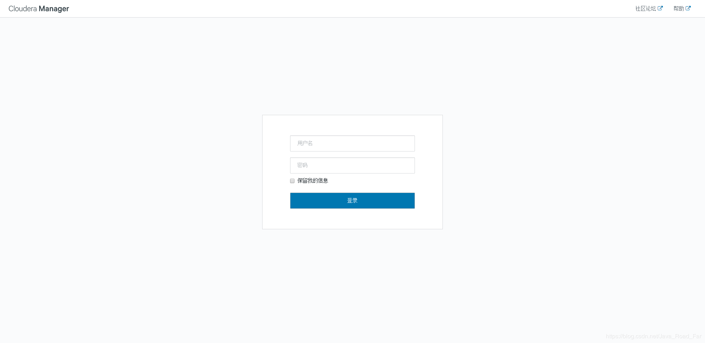

---
# 六、CDH 安装配置
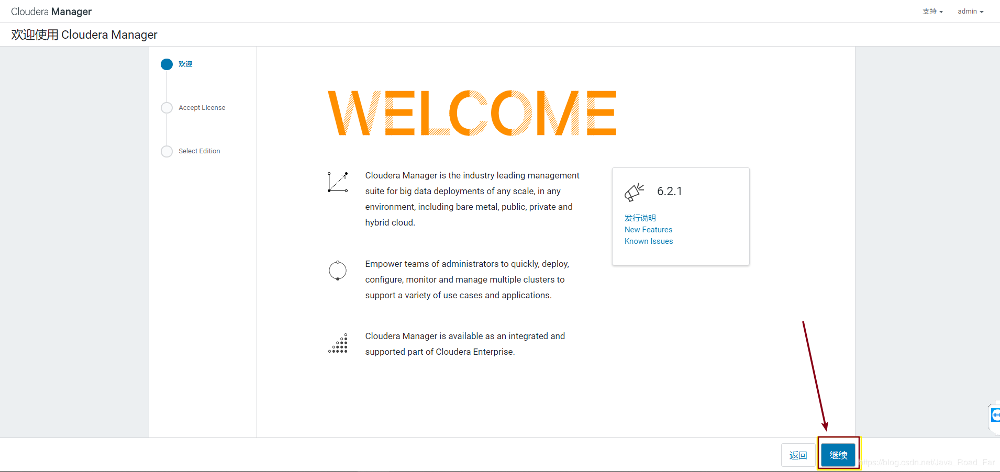
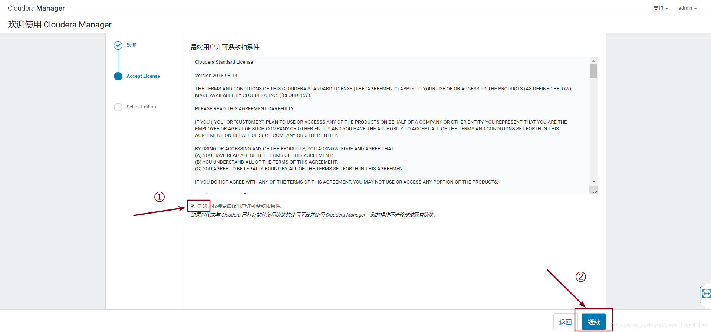
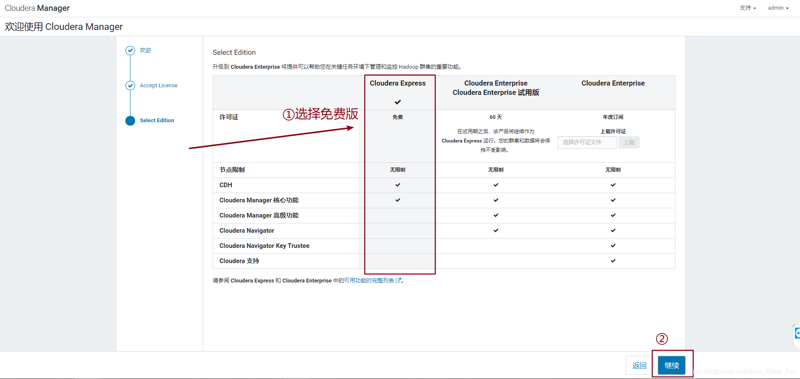
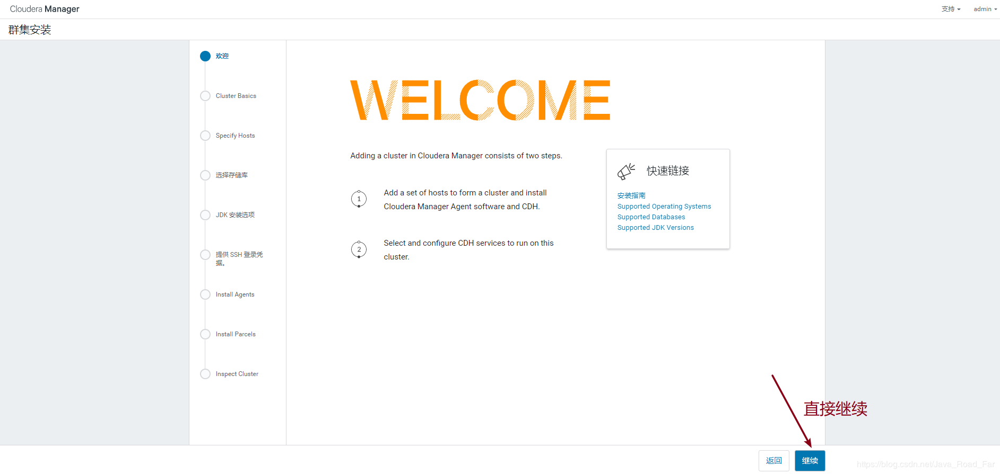
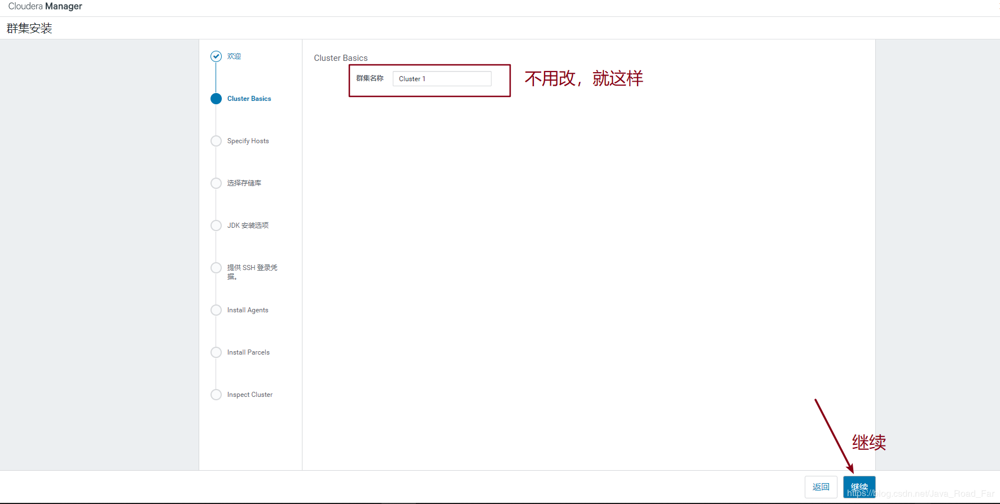


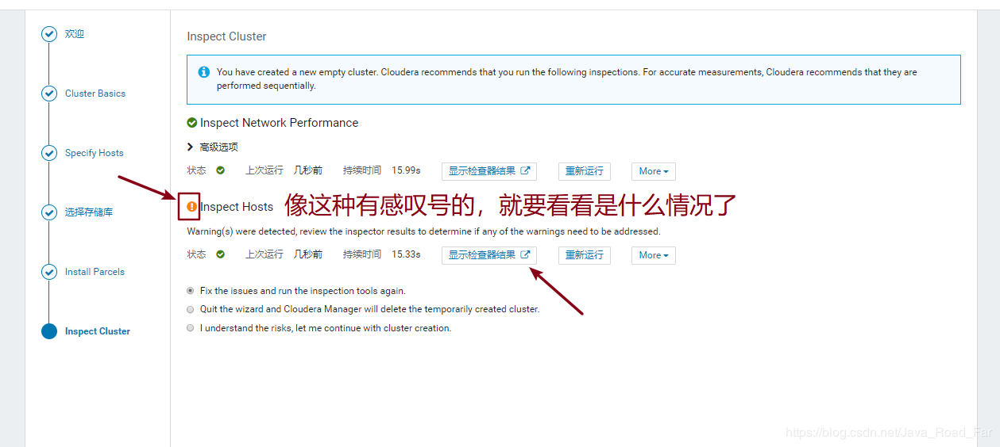

第一个问题解决方法（所有主机都要执行）：
先执行(临时修改)：

```bash
sysctl vm.swappiness=10
cat /proc/sys/vm/swappiness
```

再执行(永久修改)：

```bash
echo 'vm.swappiness=10'>> /etc/sysctl.conf
```

第二个问题解决方法（所有主机都要执行）：
```bash
echo never > /sys/kernel/mm/transparent_hugepage/defrag
echo never > /sys/kernel/mm/transparent_hugepage/enabled
echo 'echo never > /sys/kernel/mm/transparent_hugepage/defrag' >> /etc/rc.local
echo 'echo never > /sys/kernel/mm/transparent_hugepage/enabled' >> /etc/rc.local
```
都执行完成后，点击重新运行


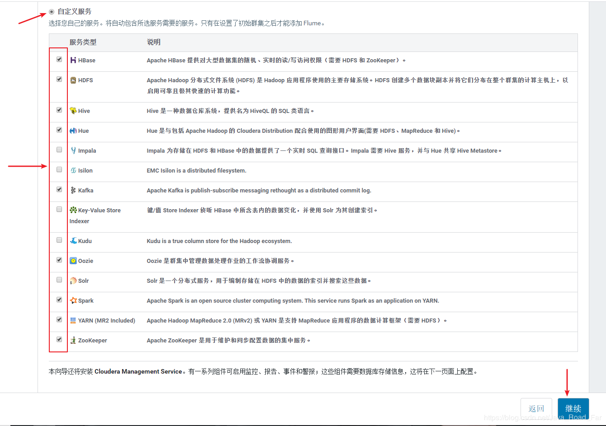
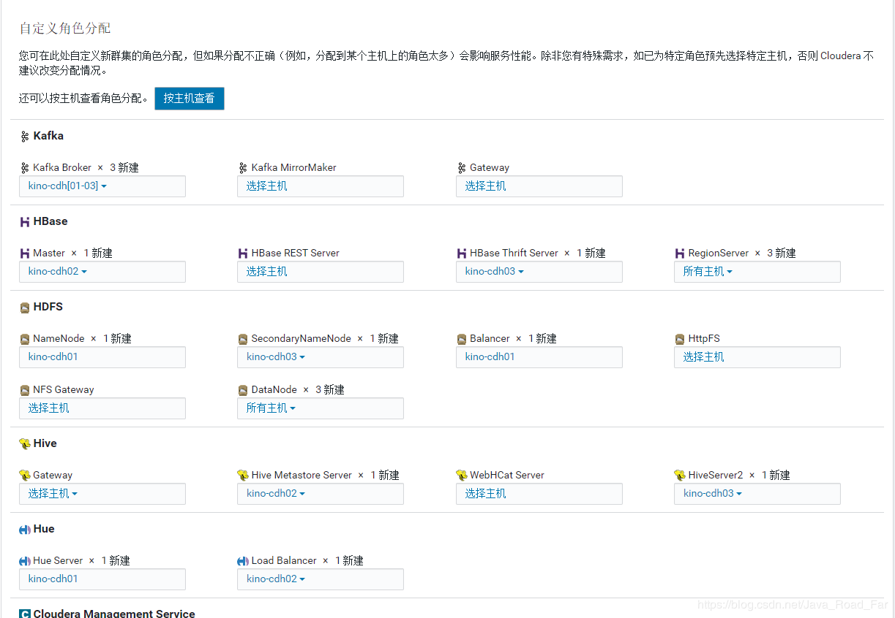
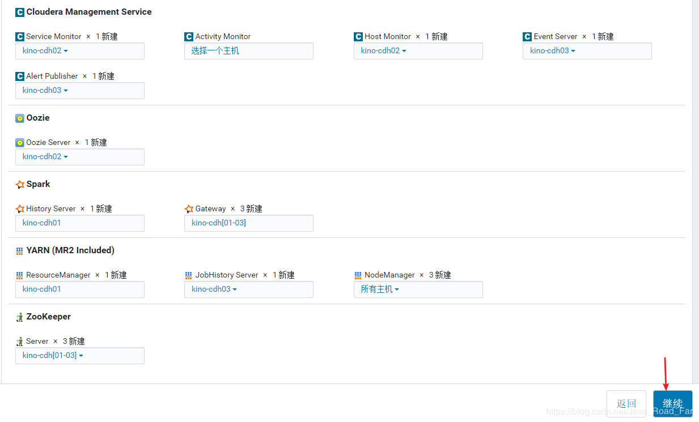


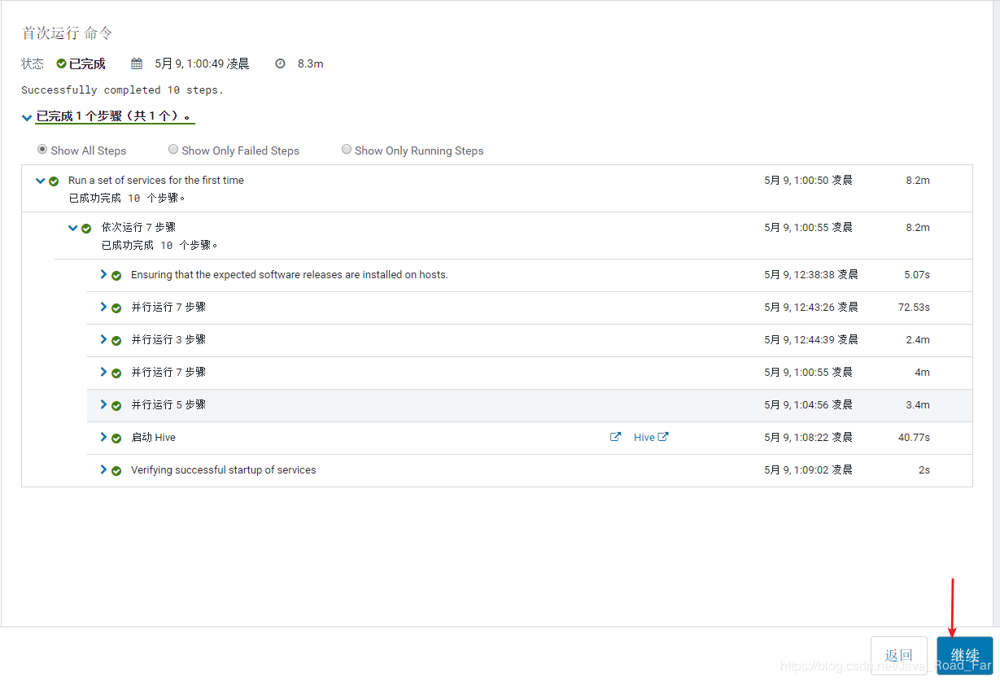

---
# 七、Hive On Spark 配置
https://blog.csdn.net/Java_Road_Far/article/details/104899098

---

关于上述所有步骤，也可以参照如下链接进行安装：
https://www.cnblogs.com/swordfall/p/10816797.html#auto_id_6

其中数据库的安装建议按照官网安装

官网安装地址为
https://docs.cloudera.com/documentation/enterprise/6/6.1/topics/cm_ig_reqs_space.html#concept_tjd_4yc_gr

软硬件环境要求：
各节点：内存推荐16GB及以上，硬盘推荐200GB及以上，网络通畅

## 7.1 关闭Spark动态分配资源参数
spark和hive中, 把勾挑了:
```bash
spark.dynamicAllocation.enabled
```

---


# 八、NameNode HA
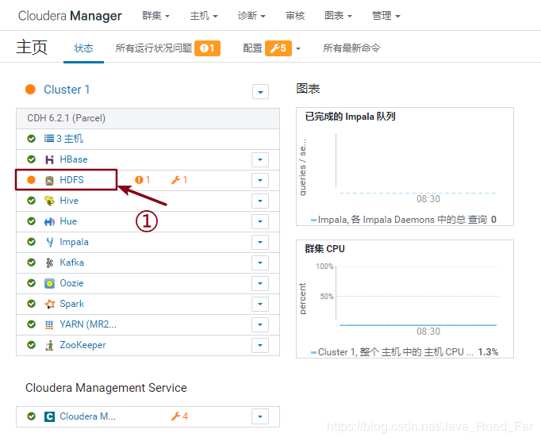
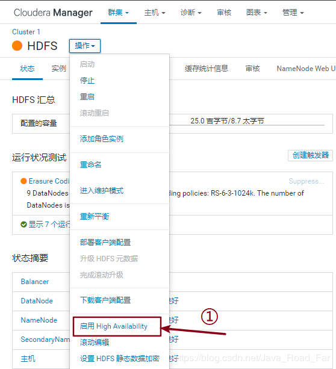

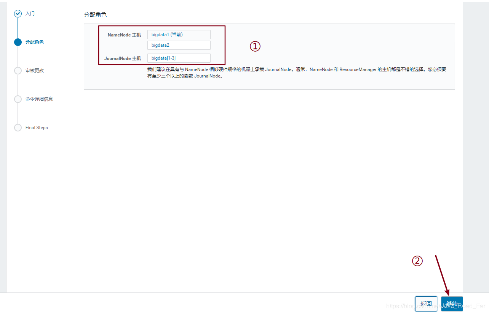
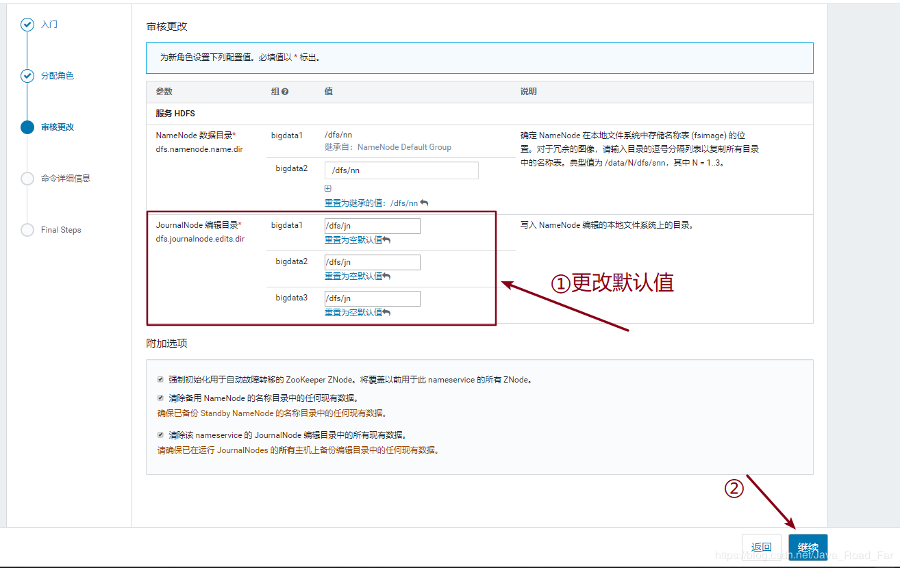
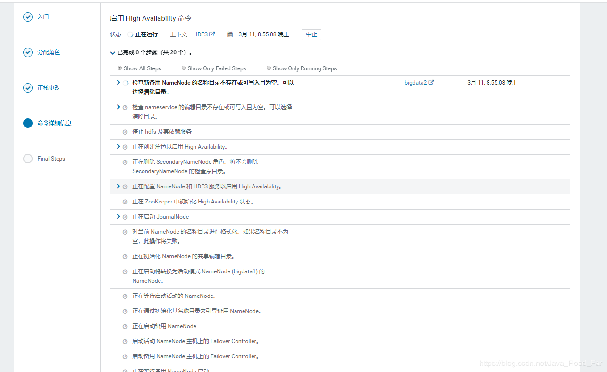
等待大概十分钟，NameNode HA 配置完成

---
# 九、修改默认参数配置
Spark的参数修改

将安装包中的: `spark-ext` 拷贝(每台节点都要拷贝)到每台服务器的: `/usr/lib`目录下，并且搜索如下参数添加配置: 

**spark-conf/spark-env.sh 的 Spark 服务高级配置代码段（安全阀）**

**spark-conf/spark-env.sh 的 Spark 客户端高级配置代码段（安全阀）**

**spark-conf/spark-env.sh 的 History Server 高级配置代码段（安全阀）**

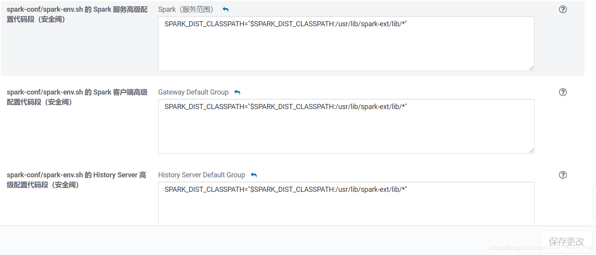

---
# 十、Phoenix 安装(所有的节点都要执行)
将 安装包中的 `apache-phoenix-5.0.0-HBase-2.0-bin.tar.gz` 拷贝到 `/root` 目录下，解压，将名字换成 `phoenix`


将 `/root/phoenix` 下的 `phoenix-core-5.0.0-HBase-2.0.jar`  拷贝(不是移动)到 `/opt/cloudera/parcels/CDH-6.2.1-1.cdh6.2.1.p0.1425774/lib/hbase/lib/` 目录下
将 `/usr/lib/spark-ext/lib` 下的 `htrace-core-3.1.0-incubating.jar`  拷贝(不是移动)到 `/opt/cloudera/parcels/CDH-6.2.1-1.cdh6.2.1.p0.1425774/lib/hbase/lib/` 目录下  
```bash
[root@bigdata1 ~]# cp /root/phoenix/phoenix-core-5.0.0-HBase-2.0.jar /opt/cloudera/parcels/CDH-6.2.1-1.cdh6.2.1.p0.1425774/lib/hbase/lib/

[root@bigdata1 ~]# cp /root/phoenix/phoenix-5.0.0-HBase-2.1-server.jar /opt/cloudera/parcels/CDH-6.2.1-1.cdh6.2.1.p0.1425774/lib/hbase/lib/

[root@bigdata1 ~]# cp /usr/lib/spark-ext/lib/htrace-core-3.1.0-incubating.jar /opt/cloudera/parcels/CDH-6.2.1-1.cdh6.2.1.p0.1425774/lib/hbase/lib/
```
然后修改这两个jar的权限为777
```bash
[root@bigdata1 ~]# chmod 777 /opt/cloudera/parcels/CDH-6.2.1-1.cdh6.2.1.p0.1425774/lib/hbase/lib/htrace-core-3.1.0-incubating.jar

[root@bigdata1 ~]# chmod 777 /opt/cloudera/parcels/CDH-6.2.1-1.cdh6.2.1.p0.1425774/lib/hbase/lib/phoenix-5.0.0-HBase-2.1-server.jar

[root@bigdata1 ~]# chmod 777 /opt/cloudera/parcels/CDH-6.2.1-1.cdh6.2.1.p0.1425774/lib/hbase/lib/phoenix-core-5.0.0-HBase-2.0.jar
```
打开 CDH 界面，修改 HBase 如下两个参数
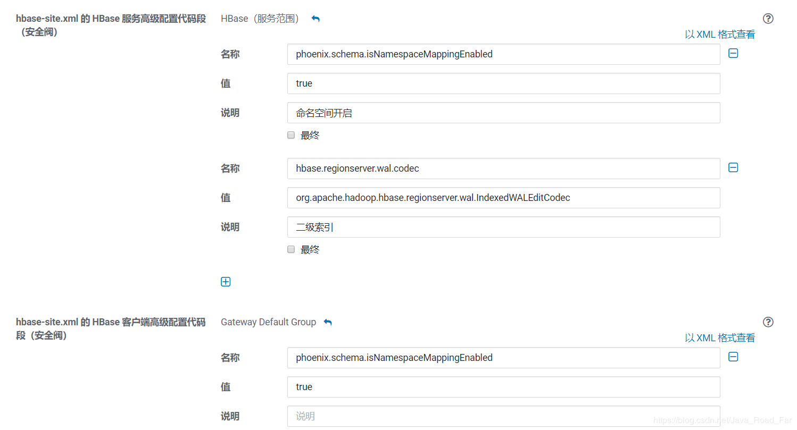
**hbase-site.xml 的 HBase 服务高级配置代码段（安全阀）**
```bash
phoenix.schema.isNamespaceMappingEnabled
true
命名空间开启

hbase.regionserver.wal.codec
org.apache.hadoop.hbase.regionserver.wal.IndexedWALEditCodec
二级索引
```
**hbase-site.xml 的 HBase 客户端高级配置代码段（安全阀）**
```bash
phoenix.schema.isNamespaceMappingEnabled 
true
```
重启HBase

将 hdfs 和 hbase 相关配置文件拷贝到 phoenix/bin目录下（所有节点都要执行）
```bash
[root@bigdata1 ~]# cp /opt/cloudera/parcels/CDH-6.2.1-1.cdh6.2.1.p0.1425774/lib/hbase/conf/hbase-site.xml /root/phoenix/bin/
cp: overwrite ‘/root/phoenix/bin/hbase-site.xml’? y

[root@bigdata1 ~]# cp /opt/cloudera/parcels/CDH-6.2.1-1.cdh6.2.1.p0.1425774/lib/hadoop/etc/hadoop/core-site.xml /root/phoenix/bin/

[root@bigdata1 ~]# cp /opt/cloudera/parcels/CDH-6.2.1-1.cdh6.2.1.p0.1425774/lib/hadoop/etc/hadoop/hdfs-site.xml /root/phoenix/bin/

[root@bigdata1 ~]# cp /opt/cloudera/parcels/CDH-6.2.1-1.cdh6.2.1.p0.1425774/lib/hadoop/etc/hadoop/yarn-site.xml /root/phoenix/bin/
```
连接 Phoenix
```bash
[root@bigdata1 phoenix]# bin/sqlline.py 
```
如果出现如下错误：
```java
Transaction isolation: TRANSACTION_READ_COMMITTED
Building list of tables and columns for tab-completion (set fastconnect to true to skip)...
Error: ERROR 1012 (42M03): Table undefined. tableName=SYSTEM.CATALOG (state=42M03,code=1012)
org.apache.phoenix.schema.TableNotFoundException: ERROR 1012 (42M03): Table undefined. tableName=SYSTEM.CATALOG
 at org.apache.phoenix.compile.FromCompiler$BaseColumnResolver.createTableRef(FromCompiler.java:577)
 at org.apache.phoenix.compile.FromCompiler$SingleTableColumnResolver.<init>(FromCompiler.java:391)
 at org.apache.phoenix.compile.FromCompiler.getResolverForQuery(FromCompiler.java:228)
 at org.apache.phoenix.compile.FromCompiler.getResolverForQuery(FromCompiler.java:206)
 at org.apache.phoenix.jdbc.PhoenixStatement$ExecutableSelectStatement.compilePlan(PhoenixStatement.java:482)
 at org.apache.phoenix.jdbc.PhoenixStatement$ExecutableSelectStatement.compilePlan(PhoenixStatement.java:456)
 at org.apache.phoenix.jdbc.PhoenixStatement$1.call(PhoenixStatement.java:302)
 at org.apache.phoenix.jdbc.PhoenixStatement$1.call(PhoenixStatement.java:291)
 at org.apache.phoenix.call.CallRunner.run(CallRunner.java:53)
 at org.apache.phoenix.jdbc.PhoenixStatement.executeQuery(PhoenixStatement.java:290)
 at org.apache.phoenix.jdbc.PhoenixStatement.executeQuery(PhoenixStatement.java:283)
 at org.apache.phoenix.jdbc.PhoenixStatement.executeQuery(PhoenixStatement.java:1793)
 at org.apache.phoenix.jdbc.PhoenixDatabaseMetaData.getColumns(PhoenixDatabaseMetaData.java:589)
 at sqlline.SqlLine.getColumns(SqlLine.java:1103)
 at sqlline.SqlLine.getColumnNames(SqlLine.java:1127)
 at sqlline.SqlCompleter.<init>(SqlCompleter.java:81)
 at sqlline.DatabaseConnection.setCompletions(DatabaseConnection.java:84)
 at sqlline.SqlLine.setCompletions(SqlLine.java:1740)
 at sqlline.Commands.connect(Commands.java:1066)
 at sqlline.Commands.connect(Commands.java:996)
 at sun.reflect.NativeMethodAccessorImpl.invoke0(Native Method)
 at sun.reflect.NativeMethodAccessorImpl.invoke(NativeMethodAccessorImpl.java:62)
 at sun.reflect.DelegatingMethodAccessorImpl.invoke(DelegatingMethodAccessorImpl.java:43)
 at java.lang.reflect.Method.invoke(Method.java:498)
 at sqlline.ReflectiveCommandHandler.execute(ReflectiveCommandHandler.java:38)
 at sqlline.SqlLine.dispatch(SqlLine.java:809)
 at sqlline.SqlLine.initArgs(SqlLine.java:588)
 at sqlline.SqlLine.begin(SqlLine.java:661)
 at sqlline.SqlLine.start(SqlLine.java:398)
 at sqlline.SqlLine.main(SqlLine.java:291)
sqlline version 1.2.0
```
解决方法如下

```bash
[root@bigdata1 phoenix]# hbase shell
Java HotSpot(TM) 64-Bit Server VM warning: Using incremental CMS is deprecated and will likely be removed in a future release
HBase Shell
Use "help" to get list of supported commands.
Use "exit" to quit this interactive shell.
For Reference, please visit: http://hbase.apache.org/2.0/book.html#shell
Version 2.1.0-cdh6.2.1, rUnknown, Wed Sep 11 01:05:56 PDT 2019
Took 0.0020 seconds 
hbase(main):001:0> 
hbase(main):001:0> list
TABLE 
SYSTEM:CATALOG 
SYSTEM:FUNCTION 
SYSTEM:LOG 
SYSTEM:MUTEX 
SYSTEM:SEQUENCE 
SYSTEM:STATS 
6 row(s)
Took 0.3353 seconds 
=> ["SYSTEM:CATALOG", "SYSTEM:FUNCTION", "SYSTEM:LOG", "SYSTEM:MUTEX", "SYSTEM:SEQUENCE", "SYSTEM:STATS"]
hbase(main):002:0> disable 'SYSTEM:CATALOG'
Took 0.8518 seconds 
hbase(main):003:0> snapshot 'SYSTEM:CATALOG', 'cata_tableSnapshot'
Took 0.2592 seconds 
hbase(main):004:0> clone_snapshot 'cata_tableSnapshot', 'SYSTEM.CATALOG'
Took 4.2676 seconds 
hbase(main):005:0> drop 'SYSTEM:CATALOG'
Took 0.2438 seconds 
hbase(main):006:0> quit
```
然后重启HBase，重新连接 Phoenix

```bash
[root@bigdata1 phoenix]# bin/sqlline.py 
Setting property: [incremental, false]
Setting property: [isolation, TRANSACTION_READ_COMMITTED]
issuing: !connect jdbc:phoenix: none none org.apache.phoenix.jdbc.PhoenixDriver
Connecting to jdbc:phoenix:
SLF4J: Class path contains multiple SLF4J bindings.
SLF4J: Found binding in [jar:file:/root/phoenix/phoenix-5.0.0-HBase-2.0-client.jar!/org/slf4j/impl/StaticLoggerBinder.class]
SLF4J: Found binding in [jar:file:/opt/cloudera/parcels/CDH-6.2.1-1.cdh6.2.1.p0.1425774/jars/slf4j-log4j12-1.7.25.jar!/org/slf4j/impl/StaticLoggerBinder.class]
SLF4J: See http://www.slf4j.org/codes.html#multiple_bindings for an explanation.
Connected to: Phoenix (version 5.0)
Driver: PhoenixEmbeddedDriver (version 5.0)
Autocommit status: true
Transaction isolation: TRANSACTION_READ_COMMITTED
Building list of tables and columns for tab-completion (set fastconnect to true to skip)...
133/133 (100%) Done
Done
sqlline version 1.2.0
0: jdbc:phoenix:>
```
## 10.1 显示所有表
```sql
0: jdbc:phoenix:> !tables
+------------+--------------+-------------+---------------+----------+------------+----------------------------+-----------------+--------------+--+
| TABLE_CAT | TABLE_SCHEM | TABLE_NAME | TABLE_TYPE | REMARKS | TYPE_NAME | SELF_REFERENCING_COL_NAME | REF_GENERATION | INDEX_STATE | |
+------------+--------------+-------------+---------------+----------+------------+----------------------------+-----------------+--------------+--+
| | SYSTEM | CATALOG | SYSTEM TABLE | | | | | | |
| | SYSTEM | FUNCTION | SYSTEM TABLE | | | | | | |
| | SYSTEM | LOG | SYSTEM TABLE | | | | | | |
| | SYSTEM | SEQUENCE | SYSTEM TABLE | | | | | | |
| | SYSTEM | STATS | SYSTEM TABLE | | | | | | |
+------------+--------------+-------------+---------------+----------+------------+----------------------------+-----------------+--------------+--+
0: jdbc:phoenix:>
```
## 10.2 创建表
```sql
CREATE TABLE IF NOT EXISTS us_population (
state CHAR(2) NOT NULL,
city VARCHAR NOT NULL,
population BIGINT
CONSTRAINT my_pk PRIMARY KEY (state, city));
```
## 10.3 查询所有表
```sql
0: jdbc:phoenix:> !tables
+------------+--------------+----------------+---------------+----------+------------+----------------------------+-----------------+--------------+
| TABLE_CAT | TABLE_SCHEM | TABLE_NAME | TABLE_TYPE | REMARKS | TYPE_NAME | SELF_REFERENCING_COL_NAME | REF_GENERATION | INDEX_STATE |
+------------+--------------+----------------+---------------+----------+------------+----------------------------+-----------------+--------------+
| | SYSTEM | CATALOG | SYSTEM TABLE | | | | | |
| | SYSTEM | FUNCTION | SYSTEM TABLE | | | | | |
| | SYSTEM | LOG | SYSTEM TABLE | | | | | |
| | SYSTEM | SEQUENCE | SYSTEM TABLE | | | | | |
| | SYSTEM | STATS | SYSTEM TABLE | | | | | |
| | | US_POPULATION | TABLE | | | | | |
+------------+--------------+----------------+---------------+----------+------------+----------------------------+-----------------+--------------+
0: jdbc:phoenix:>
```
## 10.4 新增记录
```sql
upsert into us_population values('NY','NewYork',8143197);
upsert into us_population values('CA','Los Angeles',3844829);
upsert into us_population values('IL','Chicago',2842518);
```
## 10.5 查询表
```sql

0: jdbc:phoenix:> select * from US_POPULATION;
+--------+--------------+-------------+
| STATE | CITY | POPULATION |
+--------+--------------+-------------+
| CA | Los Angeles | 3844829 |
| IL | Chicago | 2842518 |
| NY | NewYork | 8143197 |
+--------+--------------+-------------+
3 rows selected (0.043 seconds)
```
## 10.6 删除表
```sql
0: jdbc:phoenix:> drop table us_population;
```
## 10.7 退出
```sql
0: jdbc:phoenix:> !quit
```

---
# 十一、hive测试
登陆hue: 下面两个连接随便选一个都可以
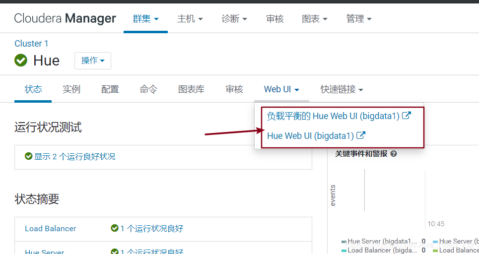
首次登陆，用户名: admin 密码: admin  

一定要记住第一次登陆设置的，你填的啥数据库里面生成的就是傻，用上面写的就可以了，登陆进去后，按下图新增hdfs 用户


然后注销 admin 用户，登陆hdfs 用户

依次执行下面的sql
```sql
create table kino(name string, age int);

insert into kino values("kino", 20);

select * from kino where name = "kino" and age = 20;
```


---
# 十二、kafka测试 
## 12.1 创建分区
选择kafka安装的一台服务器，执行如下命令，会看到一堆日志
```bash
[root@bigdata1 ~]# kafka-topics --zookeeper 10.3.4.41:2181 --create --replication-factor 3 --partitions 1 --topic mykafkatest
```
## 12.2 生产者往 上面创建的  topic  发送消息
```bash
[root@bigdata1 ~]# kafka-console-producer --broker-list 10.3.4.41:9092 --topic mykafkatest

一堆日志

>键盘输入即可....
```
## 12.3 消费者消费 topic 消息
```bash
[root@bigdata3 ~]# kafka-console-consumer -bootstrap-server 10.3.4.41:9092 --from-beginning --topic mykafkatest
```

此时生产者发送，看消费者消费到没有
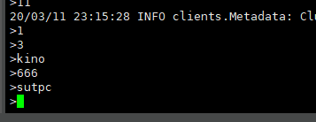
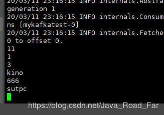


---
# 十三、CDH 邮件配置

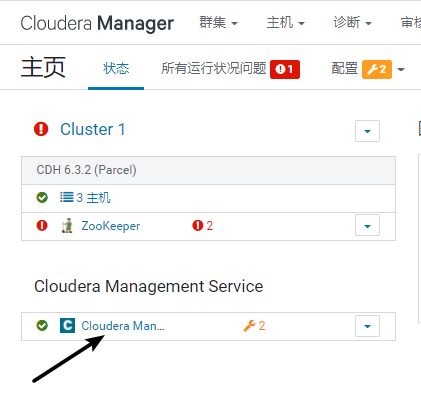

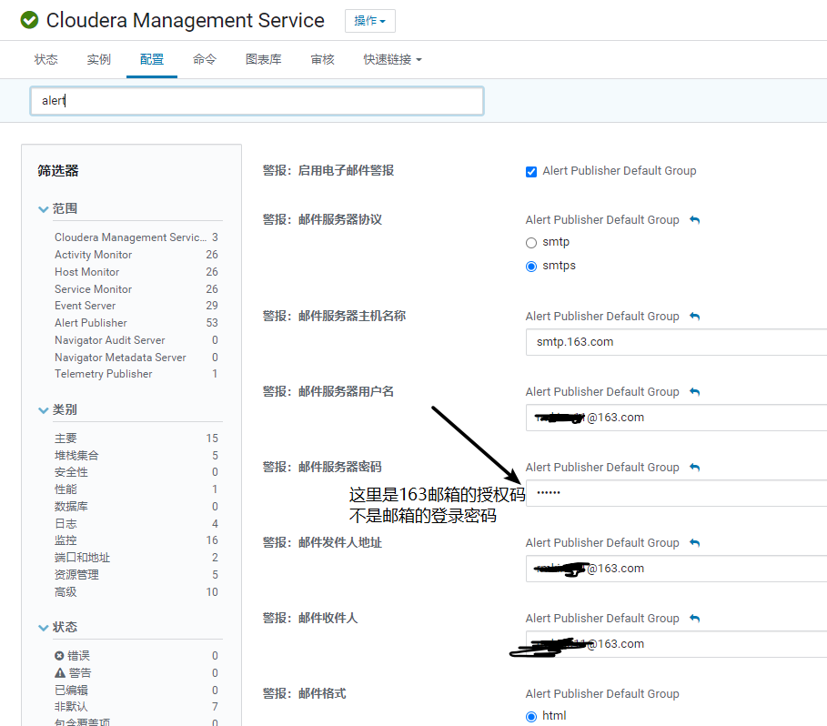

停掉 zookeeper 的两个节点

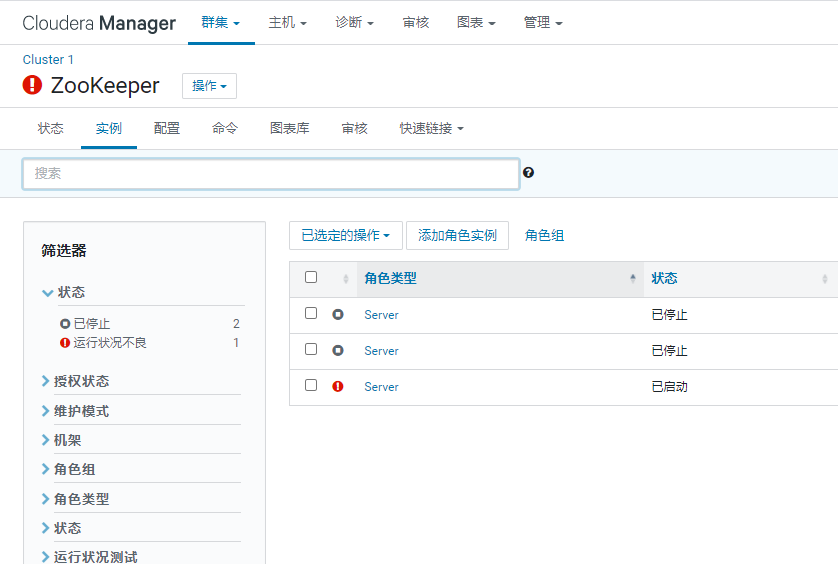

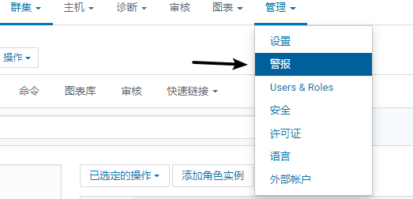


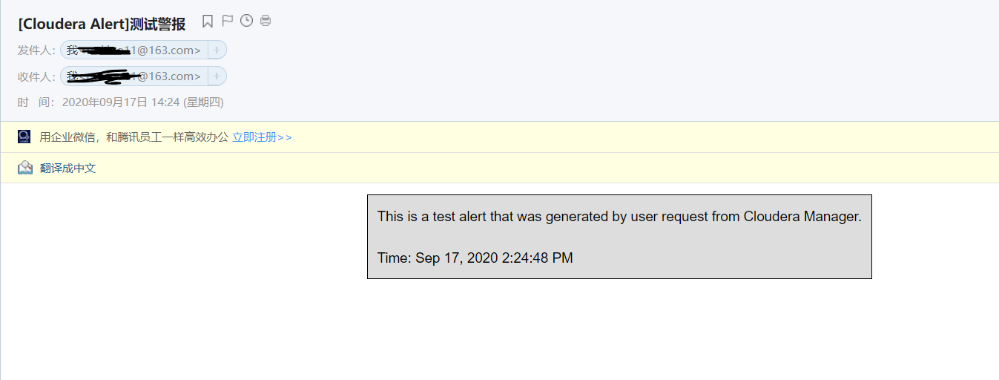


