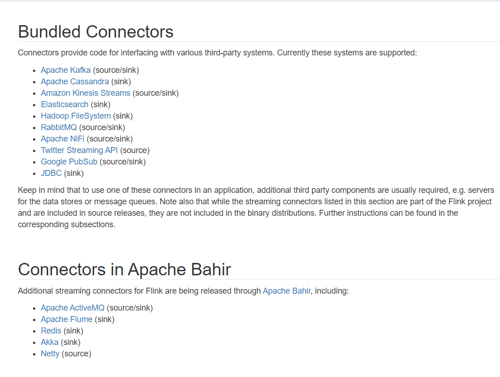

---
Flink 没有类似于 Spark 中 foreach 方法, 让用户进行迭代的操作。 虽有对外的输出操作都要利用 Sink 完成, 最后通过类似如下方式完成整个任务最重输出操作:
```scala 3
stream.addSink(new MySink(abcd))
```
官方提供了一部分的框架的 Sink. 除此以外, 需要用户自定义实现 Sink.

[官方提供的一部分框架的 Sink](https://ci.apache.org/projects/flink/flink-docs-release-1.11/zh/dev/connectors/#%E9%99%84%E5%B8%A6%E7%9A%84%E8%BF%9E%E6%8E%A5%E5%99%A8)




# 一、Kafka Sink
在前面的文章 [Flink Source](../../note/flink/flinkSource.md) 中, 列举了 Kafka Source, 这里讲述 Kafka Sink

添加 pom 依赖
```xml
<!--
https://mvnrepository.com/artifact/org.apache.flink/flink-connector-kafka-0.11
-->
<dependency>
<groupId>org.apache.flink</groupId>
<artifactId>flink-connector-kafka-0.11_2.12</artifactId>
<version>1.10.1</version>
</dependency>
```
Kafka Sink 代码如下:
```scala 3
package day03

import java.util.Properties
import org.apache.flink.api.common.serialization.SimpleStringSchema
import org.apache.flink.streaming.api.scala._
import org.apache.flink.streaming.connectors.kafka.FlinkKafkaConsumer011
import org.apache.flink.streaming.connectors.kafka.FlinkKafkaProducer011

object MySink {
    def main(args: Array[String]): Unit = {
        val env = StreamExecutionEnvironment.getExecutionEnvironment

        val properties = new Properties()
        properties.setProperty("bootstrap.servers", "bigdata001:9092")
        properties.setProperty("group.id", "consumer-group1")
        properties.setProperty("zookeeper.connect", "bigdata001:2181")
        properties.setProperty("key.deserializer", "org.apache.kafka.common.serialization.StringDeserializer")
        properties.setProperty("value.deserializer", "org.apache.kafka.common.serialization.StringDeserializer")
        properties.setProperty("auto.offset.reset", "earliest")

        val stream = env.addSource(new FlinkKafkaConsumer011[String]("sensor", new SimpleStringSchema(), properties))

        stream.print()

        val myProducer = new FlinkKafkaProducer011[String]("bigdata001:9092","sensor1",new SimpleStringSchema())

        myProducer.setWriteTimestampToKafka(true)

        stream.addSink(myProducer)


        env.execute()
    }
}
```
启动 Kafka 生产者, 在 topic 为 sensor 中生产如下消息:
```bash
> sensor_1,1547718199,35.8
> sensor_6,1547718201,15.4
> sensor_7,1547718202,6.7
> sensor_10,1547718205,38.1
> sensor_1,1547718199,35.8
> sensor_1,1547718199,35.8
> sensor_1,1547718199,35.8
> sensor_6,1547718201,15.4
> sensor_7,1547718202,6.7
> sensor_10,1547718205,38.1
> sensor_1,1547718199,35.8
> sensor_1,1547718199,35.8
```
启动 Kafka 消费者, 消费 topic 为 sensor1 的消息:
```bash
20/09/14 11:25:40 INFO internals.Fetcher: [Consumer clientId=consumer-1, groupId=console-consumer-69271] Resetting offset for partition sensor1-0 to offset 0.
sensor_1,1547718199,35.8
sensor_6,1547718201,15.4
sensor_7,1547718202,6.7
sensor_10,1547718205,38.1
sensor_1,1547718199,35.8
sensor_1,1547718199,35.8
sensor_1,1547718199,35.8
sensor_6,1547718201,15.4
sensor_7,1547718202,6.7
sensor_10,1547718205,38.1
sensor_1,1547718199,35.8
sensor_1,1547718199,35.8
```


# 二、Redis Sink
添加 pom 依赖
```xml
<!-- https://mvnrepository.com/artifact/org.apache.bahir/flink-connector-redis-->
<dependency>
<groupId>org.apache.bahir</groupId>
<artifactId>flink-connector-redis_2.11</artifactId>
<version>1.0</version>
</dependency>
```
代码如下:
```scala 3
package day03
import Mode.SensorReading
import java.util.Properties
import org.apache.flink.api.common.serialization.SimpleStringSchema
import org.apache.flink.streaming.api.scala._
import org.apache.flink.streaming.connectors.kafka._
import org.apache.flink.streaming.connectors.redis.common.mapper.RedisMapper
import org.apache.flink.streaming.connectors.redis.common.mapper.RedisCommandDescription
import org.apache.flink.streaming.connectors.redis.common.mapper.RedisCommand

object MyRedisSink {

    def main(args: Array[String]): Unit = {
        import org.apache.flink.streaming.connectors.redis.RedisSink
        import org.apache.flink.streaming.connectors.redis.common.config.{FlinkJedisConfigBase, FlinkJedisPoolConfig}
        val env = StreamExecutionEnvironment.getExecutionEnvironment

        val properties = new Properties()
        properties.setProperty("bootstrap.servers", "bigdata001:9092")
        properties.setProperty("group.id", "consumer-group1")
        properties.setProperty("zookeeper.connect", "bigdata001:2181")
        properties.setProperty("key.deserializer", "org.apache.kafka.common.serialization.StringDeserializer")
        properties.setProperty("value.deserializer", "org.apache.kafka.common.serialization.StringDeserializer")
        properties.setProperty("auto.offset.reset", "earliest")

        val stream = env.addSource(new FlinkKafkaConsumer011[String]("sensor", new SimpleStringSchema(), properties))
                .map(x => {
                    val dataArray = x.split(",")
                    SensorReading(dataArray(0).trim, dataArray(1).trim.toLong, dataArray(2).trim.toDouble)
                })
        stream.print()

        val conf = new FlinkJedisPoolConfig.Builder().setHost("192.168.220.10").setPort(6379).build()


        stream.addSink(new RedisSink[SensorReading](conf, new MyRedisMapper))

        env.execute()
    }
}

class MyRedisMapper extends RedisMapper[SensorReading]{

    override def getCommandDescription: RedisCommandDescription = {
        //把传感器id和温度值保存成哈希表: HSET key field value
        new RedisCommandDescription(RedisCommand.HSET, "sensor_temperature")
    }

    override def getKeyFromData(data: SensorReading): String = {
        data.id
    }

    override def getValueFromData(data: SensorReading): String = {
        data.temperature.toString
    }
}
```

[docker 安装 redis](https://github.com/KinoMin/bigdata-learning-notes/blob/master/note/docker/Docker%E5%B8%B8%E7%94%A8%E5%AE%89%E8%A3%85.md#%E5%9B%9B%E5%AE%89%E8%A3%85redis)

启动 Kafka 输入如下内容:
```bash
sensor_1,1547718199,35.8
```

redis 查看结果:
```bash
127.0.0.1:6379> KEYS *
1) "sensor_temperature"
2) "k1"
127.0.0.1:6379> hgetall sensor_temperature
1) "sensor_1"
2) "35.8"
```

# 三、ES Sink


# 四、自定义JDBC Sink