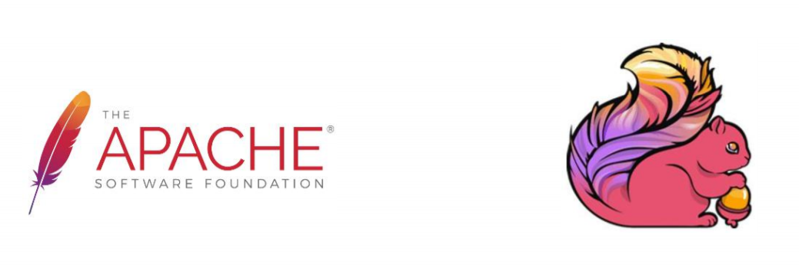
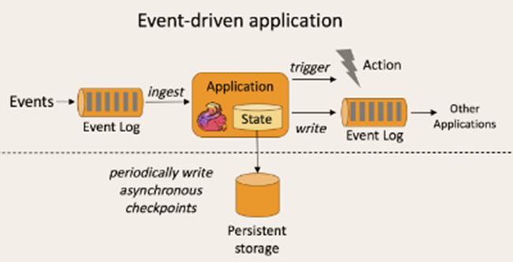
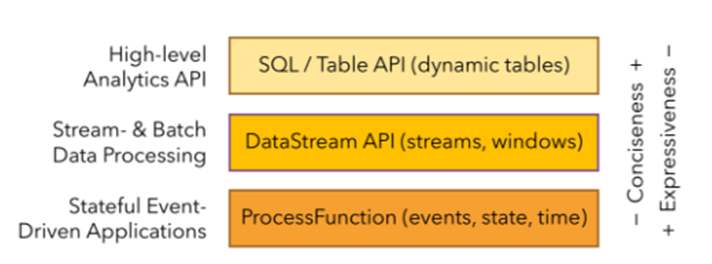

----
# 一、Flink 官网地址
https://flink.apache.org/

# 二、Flink 简介
Flink起源于Stratosphere项目，Stratosphere是在2010~2014年由3所地处柏林的大学和欧洲的一些其他的大学共同进行的研究项目，2014年4月Stratosphere的代码被复制并捐赠给了Apache软件基金会，参加这个孵化项目的初始成员是Stratosphere系统的核心开发人员，2014年12月，Flink一跃成为Apache软件基金会的顶级项目。

在德语中，Flink一词表示快速和灵巧，项目采用一只松鼠的彩色图案作为logo，这不仅是因为松鼠具有快速和灵巧的特点，还因为柏林的松鼠有一种迷人的红棕色，而Flink的松鼠logo拥有可爱的尾巴，尾巴的颜色与Apache软件基金会的logo颜色相呼应，也就是说，这是一只Apache风格的松鼠。

Flink项目的理念是：“***Apache Flink是为分布式、高性能、随时可用以及准确的流处理应用程序打造的开源流处理框架***”。

Apache Flink是一个框架和分布式处理引擎，用于对无界和有界数据流进行有状态计算。Flink被设计在所有常见的集群环境中运行，以内存执行速度和任意规模来执行计算。

# 三、Flink的重要特点
## 3.1 事件驱动型(Event-driven)
事件驱动型应用是一类具有状态的应用，它从一个或多个事件流提取数据，并根据到来的事件触发计算、状态更新或其他外部动作。比较典型的就是以kafka为代表的消息队列几乎都是事件驱动型应用。

与之不同的就是SparkStreaming微批次，如图: 

事件驱动型: 

## 3.2 流与批的世界观
***批处理***的特点是有界、持久、大量，非常适合需要访问全套记录才能完成的计算工作，一般用于离线统计。

***流处理***的特点是无界、实时,  无需针对整个数据集执行操作，而是对通过系统传输的每个数据项执行操作，一般用于实时统计。

在spark的世界观中，一切都是由批次组成的，离线数据是一个大批次，而实时数据是由一个一个无限的小批次组成的。

而在flink的世界观中，一切都是由流组成的，离线数据是有界限的流，实时数据是一个没有界限的流，这就是所谓的有界流和无界流。

***无界数据流***：无界数据流有一个开始但是没有结束，它们不会在生成时终止并提供数据，必须连续处理无界流，也就是说必须在获取后立即处理event。对于无界数据流我们无法等待所有数据都到达，因为输入是无界的，并且在任何时间点都不会完成。处理无界数据通常要求以特定顺序（例如事件发生的顺序）获取event，以便能够推断结果完整性。

***有界数据流***：有界数据流有明确定义的开始和结束，可以在执行任何计算之前通过获取所有数据来处理有界流，处理有界流不需要有序获取，因为可以始终对有界数据集进行排序，有界流的处理也称为批处理。

这种以流为世界观的架构，获得的最大好处就是具有极低的延迟。

## 3.3 分层api

最底层级的抽象仅仅提供了有状态流，它将通过过程函数（Process Function）被嵌入到DataStream API中。底层过程函数（Process Function） 与 DataStream API 相集成，使其可以对某些特定的操作进行底层的抽象，它允许用户可以自由地处理来自一个或多个数据流的事件，并使用一致的容错的状态。除此之外，用户可以注册事件时间并处理时间回调，从而使程序可以处理复杂的计算。

实际上，大多数应用并不需要上述的底层抽象，而是针对核心API（Core APIs） 进行编程，比如DataStream API（有界或无界流数据）以及DataSet API（有界数据集）。这些API为数据处理提供了通用的构建模块，比如由用户定义的多种形式的转换（transformations），连接（joins），聚合（aggregations），窗口操作（windows）等等。DataSet API 为有界数据集提供了额外的支持，例如循环与迭代。这些API处理的数据类型以类（classes）的形式由各自的编程语言所表示。

Table API 是以表为中心的声明式编程，其中表可能会动态变化（在表达流数据时）。Table API遵循（扩展的）关系模型：表有二维数据结构（schema）（类似于关系数据库中的表），同时API提供可比较的操作，例如select、project、join、group-by、aggregate等。Table API程序声明式地定义了什么逻辑操作应该执行，而不是准确地确定这些操作代码的看上去如何。

尽管Table API可以通过多种类型的用户自定义函数（UDF）进行扩展，其仍不如核心API更具表达能力，但是使用起来却更加简洁（代码量更少）。除此之外，Table API程序在执行之前会经过内置优化器进行优化。

你可以在表与 DataStream/DataSet 之间无缝切换，以允许程序将 Table API 与 DataStream 以及 DataSet 混合使用。

Flink提供的最高层级的抽象是 SQL 。这一层抽象在语法与表达能力上与 Table API 类似，但是是以SQL查询表达式的形式表现程序。SQL抽象与Table API交互密切，同时SQL查询可以直接在Table API定义的表上执行。

目前Flink作为批处理还不是主流，不如Spark成熟，所以DataSet使用的并不是很多。Flink Table API和Flink SQL也并不完善，大多都由各大厂商自己定制。所以我们主要学习DataStream API的使用。实际上Flink作为最接近Google DataFlow模型的实现，是流批统一的观点，所以基本上使用DataStream就可以了。

# Flink几大模块
- Flink Table & SQL(还没开发完)
- Flink Gelly(图计算)
- Flink CEP(复杂事件处理)
