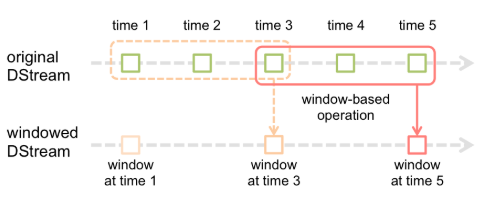

Spark Streaming提供了窗口计算，可让您在数据的滑动窗口上应用转换

一些常见的窗口操作如下。所有这些操作都采用上述两个参数-`windowLength(窗口长度)`和`slideInterval(滑动步长)`。
窗口函数  | 描述
--|--
window（windowLength，slideInterval）|	Return a new DStream which is computed based on windowed batches of the source DStream.
countByWindow（windowLength，slideInterval）|	Return a sliding window count of elements in the stream.
reduceByKeyAndWindow（func，windowLength，slideInterval，[ numTasks ]）|	Return a new single-element stream, created by aggregating elements in the stream over a sliding interval using func. The function should be associative and commutative so that it can be computed correctly in parallel.
reduceByKeyAndWindow（func，invFunc，windowLength， slideInterval，[ numTasks ]）	|When called on a DStream of (K, V) pairs, returns a new DStream of (K, V) pairs where the values for each key are aggregated using the given reduce function func over batches in a sliding window. Note: By default, this uses Spark's default number of parallel tasks (2 for local mode, and in cluster mode the number is determined by the config property spark.default.parallelism) to do the grouping. You can pass an optional numTasks argument to set a different number of tasks.
countByValueAndWindow（windowLength， slideInterval，[ numTasks ]）|	When called on a DStream of (K, V) pairs, returns a new DStream of (K, Long) pairs where the value of each key is its frequency within a sliding window. Like in reduceByKeyAndWindow, the number of reduce tasks is configurable through an optional argument.


reduceByKeyAndWindow 窗口函数有两个重载方法

一般情况下，我们会写 
```java
//reduceByKeyAndWindow（func，windowLength，slideInterval，[ numTasks ]）

val df = socketDStream // 从socket 得到值
          .flatMap(_.split(" "))
          .map((_, 1))
          .reduceByKeyAndWindow(
              (_: Int) + (_: Int),
              Seconds(3),
              Seconds(2))
```

也就是最上面官方给出的那种图，每 2 秒，统计前3秒的数据(当前时间点的前3秒)，此时此刻我们看到，当前窗口和前一个窗口重叠了一部分数据，导致 time3 会被计算两次，要想 time3不被计算两次，我们就要用到 reduceByKeyAndWindow 的重载方法：
```java
reduceByKeyAndWindow(func，invFunc，windowLength， slideInterval，[ numTasks ])
```


我们先看看官方给出的函数描述，翻译过来就是说：
>该重载方法比 reduceByKeyAndWindow(func，windowLength，slideInterval，[ numTasks ]) 更加高效

>原因是，其中每个窗口的 reduce 值，使用前一个窗口的 reduce 值递增计算，得到当前前窗口的 reduce 值，然后减去 前一个窗口 失效的值

也就是说，计算规则变成了：
>window1 = time1 + time2 + time3
window2 = window1 + time3 + time 4 - time1 - time2 => time3 + time4 + time5

那么实现起来就是
```java
val df1 = socketDStream
          .flatMap(_.split(" "))
          .map((_, 1))
          .reduceByKeyAndWindow(
              (_: Int) + (_: Int),
              (_: Int) - (_: Int),
              Seconds(3),
              Seconds(2))
```
其中第一个函数值 `_+_` 是 对滑动后窗口中新的数据（time4， time5）进行累加统计
第二个函数 `_-_`是对滑动后，前一个窗口过时的数据（time1，time2）进行减去统计

---
看一节完整案例：**从 socket 接受数据做 wordCount**
```java
package apache

import org.apache.spark.SparkConf
import org.apache.spark.streaming.{Seconds, StreamingContext}
import org.apache.spark.streaming.dstream.ReceiverInputDStream

/**
  * @author kino
  * @version 1.0.0
  */
object ReduceByKeyWindow2 {
    def main(args: Array[String]): Unit = {
        val ssc = new StreamingContext(
            new SparkConf()
              .setMaster("local[2]")
              .setAppName("reduceByWindow"),
            Seconds(1))
        ssc.checkpoint("./reduceByKeyWindowPoint")

        val socketDStream: ReceiverInputDStream[String] = ssc.socketTextStream("hadoop102", 9999)

        val df = socketDStream
          .flatMap(_.split(" "))
          .map((_, 1))
          .reduceByKeyAndWindow(
              (_: Int) + (_: Int),
              Seconds(3),
              Seconds(2))

        val df1 = socketDStream
          .flatMap(_.split(" "))
          .map((_, 1))
          .reduceByKeyAndWindow(
              (_: Int) + (_: Int),
              (_: Int) + (_: Int),
              Seconds(3),
              Seconds(2))

        df.print
        df1.print
        ssc.start
        ssc.awaitTermination
    }
}
```