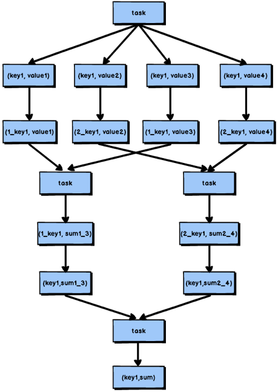

* [数据倾斜的表现](#%E6%95%B0%E6%8D%AE%E5%80%BE%E6%96%9C%E7%9A%84%E8%A1%A8%E7%8E%B0)
* [定位数据倾斜问题](#%E5%AE%9A%E4%BD%8D%E6%95%B0%E6%8D%AE%E5%80%BE%E6%96%9C%E9%97%AE%E9%A2%98)
* [一、聚合原数据](#%E4%B8%80%E8%81%9A%E5%90%88%E5%8E%9F%E6%95%B0%E6%8D%AE)
  * [1\.1 避免shuffle过程](#11-%E9%81%BF%E5%85%8Dshuffle%E8%BF%87%E7%A8%8B)
  * [1\.2 缩小key粒度（增大数据倾斜可能性，降低每个task的数据量）](#12-%E7%BC%A9%E5%B0%8Fkey%E7%B2%92%E5%BA%A6%E5%A2%9E%E5%A4%A7%E6%95%B0%E6%8D%AE%E5%80%BE%E6%96%9C%E5%8F%AF%E8%83%BD%E6%80%A7%E9%99%8D%E4%BD%8E%E6%AF%8F%E4%B8%AAtask%E7%9A%84%E6%95%B0%E6%8D%AE%E9%87%8F)
  * [1\.3 增大key粒度（减小数据倾斜可能性，增大每个task的数据量）](#13-%E5%A2%9E%E5%A4%A7key%E7%B2%92%E5%BA%A6%E5%87%8F%E5%B0%8F%E6%95%B0%E6%8D%AE%E5%80%BE%E6%96%9C%E5%8F%AF%E8%83%BD%E6%80%A7%E5%A2%9E%E5%A4%A7%E6%AF%8F%E4%B8%AAtask%E7%9A%84%E6%95%B0%E6%8D%AE%E9%87%8F)
* [二、过滤导致倾斜的key](#%E4%BA%8C%E8%BF%87%E6%BB%A4%E5%AF%BC%E8%87%B4%E5%80%BE%E6%96%9C%E7%9A%84key)
* [三、提高shuffle操作中的reduce并行度](#%E4%B8%89%E6%8F%90%E9%AB%98shuffle%E6%93%8D%E4%BD%9C%E4%B8%AD%E7%9A%84reduce%E5%B9%B6%E8%A1%8C%E5%BA%A6)
  * [3\.1 reduce端并行度的设置](#31-reduce%E7%AB%AF%E5%B9%B6%E8%A1%8C%E5%BA%A6%E7%9A%84%E8%AE%BE%E7%BD%AE)
  * [3\.2 reduce端并行度设置存在的缺陷](#32-reduce%E7%AB%AF%E5%B9%B6%E8%A1%8C%E5%BA%A6%E8%AE%BE%E7%BD%AE%E5%AD%98%E5%9C%A8%E7%9A%84%E7%BC%BA%E9%99%B7)
  * [四、使用随机key实现双重聚合](#%E5%9B%9B%E4%BD%BF%E7%94%A8%E9%9A%8F%E6%9C%BAkey%E5%AE%9E%E7%8E%B0%E5%8F%8C%E9%87%8D%E8%81%9A%E5%90%88)
* [五、将reduce join转换为map join](#%E4%BA%94%E5%B0%86reduce-join%E8%BD%AC%E6%8D%A2%E4%B8%BAmap-join)
  * [注意](#%E6%B3%A8%E6%84%8F)
  * [不适用场景分析](#%E4%B8%8D%E9%80%82%E7%94%A8%E5%9C%BA%E6%99%AF%E5%88%86%E6%9E%90)
* [六、sample采样对倾斜key单独进行join](#%E5%85%ADsample%E9%87%87%E6%A0%B7%E5%AF%B9%E5%80%BE%E6%96%9Ckey%E5%8D%95%E7%8B%AC%E8%BF%9B%E8%A1%8Cjoin)
  * [适用场景分析](#%E9%80%82%E7%94%A8%E5%9C%BA%E6%99%AF%E5%88%86%E6%9E%90)
  * [不适用场景分析](#%E4%B8%8D%E9%80%82%E7%94%A8%E5%9C%BA%E6%99%AF%E5%88%86%E6%9E%90-1)
* [七、使用随机数以及扩容进行join](#%E4%B8%83%E4%BD%BF%E7%94%A8%E9%9A%8F%E6%9C%BA%E6%95%B0%E4%BB%A5%E5%8F%8A%E6%89%A9%E5%AE%B9%E8%BF%9B%E8%A1%8Cjoin)
  * [核心思想](#%E6%A0%B8%E5%BF%83%E6%80%9D%E6%83%B3)
  * [局限性](#%E5%B1%80%E9%99%90%E6%80%A7)

----

Spark 中的数据倾斜问题主要指shuffle过程中出现的数据倾斜问题，是由于不同的key对应的数据量不同导致的不同task所处理的数据量不同的问题。

例如，reduce点一共要处理100万条数据，第一个和第二个task分别被分配到了1万条数据，计算5分钟内完成，第三个task分配到了98万数据，此时第三个task可能需要10个小时完成，这使得整个Spark作业需要10个小时才能运行完成，这就是数据倾斜所带来的后果。

注意，要区分开数据倾斜与数据量过量这两种情况，数据倾斜是指少数task被分配了绝大多数的数据，因此少数task运行缓慢；数据过量是指所有task被分配的数据量都很大，相差不多，所有task都运行缓慢。

# 数据倾斜的表现
1. Spark 作业的大部分 task 都执行迅速，只有有限的几个task执行的非常慢，此时可能出现了数据倾斜，作业可以运行，但是运行得非常慢；
2. Spark 作业的大部分task都执行迅速，但是有的task在运行过程中会突然报出OOM，反复执行几次都在某一个task报出OOM错误，此时可能出现了数据倾斜，作业无法正常运行。

# 定位数据倾斜问题
1. 查阅代码中的shuffle算子，例如reduceByKey、countByKey、groupByKey、join等算子，根据代码逻辑判断此处是否会出现数据倾斜；
2. 查看 Spark 作业的 log 文件，log 文件对于错误的记录会精确到代码的某一行，可以根据异常定位到的代码位置来明确错误发生在第几个stage，对应的 shuffle 算子是哪一个；

# 一、聚合原数据
## 1.1 避免shuffle过程
绝大多数情况下，Spark 作业的数据来源都是 Hive 表，这些 Hive 表基本都是经过 ETL 之后的昨天的数据。 为了避免数据倾斜，我们可以考虑避免 shuffle 过程，如果避免了shuffle过程，那么从根本上就消除了发生数据倾斜问题的可能。

如果Spark作业的数据来源于Hive表，那么可以先在 Hive 表中对数据进行聚合，例如按照 key 进行分组，将同一key 对应的所有value用一种特殊的格式拼接到一个字符串里去，这样，一个key就只有一条数据了；之后，对一个key的所有value进行处理时，只需要进行map操作即可，无需再进行任何的shuffle操作。通过上述方式就避免了执行shuffle操作，也就不可能会发生任何的数据倾斜问题。

对于Hive表中数据的操作，不一定是拼接成一个字符串，也可以是直接对key的每一条数据进行累计计算。

要区分开，处理的数据量大和数据倾斜的区别

## 1.2 缩小key粒度（增大数据倾斜可能性，降低每个task的数据量）
key的数量增加，可能使数据倾斜更严重。

## 1.3 增大key粒度（减小数据倾斜可能性，增大每个task的数据量）
如果没有办法对每个key聚合出来一条数据，在特定场景下，可以考虑扩大key的聚合粒度。

例如，目前有10万条用户数据，当前key的粒度是（省，城市，区，日期），现在我们考虑扩大粒度，将key的粒度扩大为（省，城市，日期），这样的话，key的数量会减少，key之间的数据量差异也有可能会减少，由此可以减轻数据倾斜的现象和问题。（此方法只针对特定类型的数据有效，当应用场景不适宜时，会加重数据倾斜）

# 二、过滤导致倾斜的key
如果在 Spark 作业中允许丢弃某些数据，那么可以考虑将可能导致数据倾斜的 key 进行过滤，滤除可能导致数据倾斜的key对应的数据，这样，在Spark作业中就不会发生数据倾斜了。

# 三、提高shuffle操作中的reduce并行度
当方案一和方案二对于数据倾斜的处理没有很好的效果时，可以考虑提高shuffle过程中的reduce端并行度，reduce端并行度的提高就增加了reduce端task的数量，那么每个task分配到的数据量就会相应减少，由此缓解数据倾斜问题。
## 3.1 reduce端并行度的设置
在大部分的shuffle算子中，都可以传入一个并行度的设置参数，比如reduceByKey(500)，这个参数会决定shuffle过程中reduce端的并行度，在进行shuffle操作的时候，就会对应着创建指定数量的reduce task。

对于Spark SQL中的shuffle类语句，比如group by、join等，需要设置一个参数，即spark.sql.shuffle.partitions，该参数代表了shuffle read task的并行度，该值默认是200，对于很多场景来说都有点过小。

增加shuffle read task的数量，可以让原本分配给一个task的多个key分配给多个task，从而让每个task处理比原来更少的数据。

举例来说，如果原本有5个key，每个key对应10条数据，这5个key都是分配给一个task的，那么这个task就要处理50条数据。而增加了shuffle read task以后，每个task就分配到一个key，即每个task就处理10条数据，那么自然每个task的执行时间都会变短了。

## 3.2 reduce端并行度设置存在的缺陷
提高reduce端并行度并没有从根本上改变数据倾斜的本质和问题（方案一和方案二从根本上避免了数据倾斜的发生），只是尽可能地去缓解和减轻shuffle reduce task的数据压力，以及数据倾斜的问题，适用于有较多key对应的数据量都比较大的情况。

该方案通常无法彻底解决数据倾斜，因为如果出现一些极端情况，比如某个key对应的数据量有100万，那么无论你的task数量增加到多少，这个对应着100万数据的key肯定还是会分配到一个task中去处理，因此注定还是会发生数据倾斜的。所以这种方案只能说是在发现数据倾斜时尝试使用的第一种手段，尝试去用最简单的方法缓解数据倾斜而已，或者是和其他方案结合起来使用。

在理想情况下，reduce端并行度提升后，会在一定程度上减轻数据倾斜的问题，甚至基本消除数据倾斜；但是，在一些情况下，只会让原来由于数据倾斜而运行缓慢的task运行速度稍有提升，或者避免了某些task的OOM问题，但是，仍然运行缓慢，此时，要及时放弃方案三，开始尝试后面的方案。

## 四、使用随机key实现双重聚合
当使用了类似于groupByKey、reduceByKey这样的算子时，可以考虑使用随机key实现双重聚合

首先，通过map算子给每个数据的key添加随机数前缀，对key进行打散，将原先一样的key变成不一样的key，然后进行第一次聚合，这样就可以让原本被一个task处理的数据分散到多个task上去做局部聚合；

随后，去除掉每个key的前缀，再次进行聚合。

此方法对于由groupByKey、reduceByKey这类算子造成的数据倾斜由比较好的效果，仅仅适用于聚合类的shuffle操作，适用范围相对较窄。

如果是join类的shuffle操作，还得用其他的解决方案。

此方法也是前几种方案没有比较好的效果时要尝试的解决方案。

# 五、将reduce join转换为map join
正常情况下，join操作都会执行shuffle过程，并且执行的是reduce join，也就是先将所有相同的key和对应的value汇聚到一个reduce task中，然后再进行join。

普通join的过程如下图所示：

普通的join是会走shuffle过程的，而一旦shuffle，就相当于会将相同key的数据拉取到一个shuffle read task中再进行join，此时就是reduce join。

但是如果一个RDD是比较小的，则可以采用广播小RDD全量数据+map算子来实现与join同样的效果，也就是map join，此时就不会发生shuffle操作，也就不会发生数据倾斜。

## 注意
RDD是并不能进行广播的，只能将RDD内部的数据通过collect拉取到Driver内存然后再进行广播

## 不适用场景分析
由于 Spark 的广播变量是在每个Executor中保存一个副本，如果两个RDD数据量都比较大，那么如果将一个数据量比较大的 RDD 做成广播变量，那么很有可能会造成内存溢出

# 六、sample采样对倾斜key单独进行join
在 Spark 中，如果某个RDD只有一个key，那么在shuffle过程中会默认将此key对应的数据打散，由不同的reduce端task进行处理。

所以, 当由单个key导致数据倾斜时，可有将发生数据倾斜的key单独提取出来，组成一个RDD，然后用这个原本会导致倾斜的key组成的RDD跟其他RDD单独join，此时，根据 Spark 的运行机制，此 RDD 中的数据会在shuffle阶段被分散到多个task中去进行join操作。倾斜key单独join的流程如图

## 适用场景分析
对于RDD中的数据，可以将其转换为一个中间表，或者是直接使用countByKey()的方式，看一个这个RDD中各个key对应的数据量，此时如果你发现整个RDD就一个key的数据量特别多，那么就可以考虑使用这种方法。

当数据量非常大时，可以考虑使用sample采样获取10%的数据，然后分析这10%的数据中哪个key可能会导致数据倾斜，然后将这个key对应的数据单独提取出来。
## 不适用场景分析
如果一个RDD中导致数据倾斜的key很多，那么此方案不适用

# 七、使用随机数以及扩容进行join
也没什么意义，此时就只能使用最后一种方案来解决问题了，对于join操作，我们可以考虑对其中一个RDD数据进行扩容，另一个RDD进行稀释后再join。

我们会将原先一样的key通过附加随机前缀变成不一样的key，然后就可以将这些处理后的“不同key”分散到多个task中去处理，而不是让一个task处理大量的相同key。

这一种方案是针对有大量倾斜key的情况，没法将部分key拆分出来进行单独处理，需要对整个RDD进行数据扩容，对内存资源要求很高。

## 核心思想
选择一个RDD，使用flatMap进行扩容，对每条数据的key添加数值前缀（1~N的数值），将一条数据映射为多条数据；（扩容）

选择另外一个RDD，进行map映射操作，每条数据的key都打上一个随机数作为前缀（1~N的随机数）；（稀释）

## 局限性
如果两个 RDD 都很大，那么将 RDD 进行 N倍 的扩容显然行不通； 使用扩容的方式只能缓解数据倾斜，不能彻底解决数据倾斜问题。